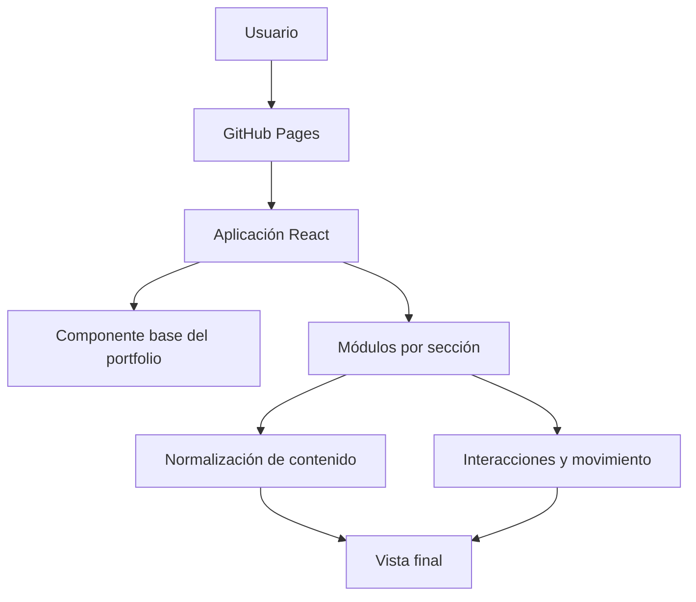

# Portfolio profesional — Dante Gabriel Balbuena Atar

Portfolio web orientado a posiciones de **Analista SOC Jr.**, gestión de incidentes y seguridad vinculada con telecomunicaciones.

El sitio presenta experiencia operativa, formación en ciberseguridad, proyectos aplicados y canales de contacto con una narrativa profesional coherente y verificable.

## Enlaces

- **Sitio publicado:** https://dante2617012022.github.io/portfolio-web/
- **GitHub:** https://github.com/Dante2617012022
- **LinkedIn:** https://www.linkedin.com/in/dante-gabriel-balbuena-179963235/

## Objetivo profesional

Conectar más de cinco años y medio de experiencia en soporte técnico y gestión de incidentes con una transición hacia operaciones defensivas de ciberseguridad.

El portfolio destaca competencias transferibles a un SOC:

- Registro, clasificación y seguimiento de incidentes.
- Priorización por impacto y criticidad.
- Trabajo bajo SLA y métricas operativas.
- Documentación y escalamiento técnico.
- Telecomunicaciones, redes y Linux Debian.
- Formación académica en SIEM, MITRE ATT&CK y respuesta inicial.

## Secciones

- **Inicio:** posicionamiento profesional y accesos rápidos.
- **Perfil:** transición desde operaciones de telecomunicaciones hacia ciberseguridad.
- **Habilidades:** separación entre uso práctico, conocimientos aplicados y laboratorios académicos.
- **Experiencia:** CityTech/Teleperformance y automatización con seguridad aplicada en Camdis.
- **Educación:** Tecnicatura Universitaria en Ciberseguridad en etapa final.
- **Proyectos:** chatbot con controles de seguridad y actividades académicas autorizadas.
- **Certificaciones:** formación complementaria relevante.
- **Contacto:** canales directos sin formularios ni recolección adicional de datos.

## Tecnologías

### Aplicación

- React 19
- Vite 7
- JavaScript
- Framer Motion
- Tailwind CSS

### Calidad y publicación

- ESLint
- GitHub Actions
- GitHub Pages
- Flujo de cambios mediante ramas y pull requests

## Arquitectura actual



La aplicación combina un componente React principal con módulos de mejora progresiva para contenido, interacciones, accesibilidad y comportamiento responsive.

```text
src/
├── PortfolioDante.jsx          interfaz base
├── main.jsx                    inicialización de la aplicación
├── content-overrides.js        normalización de contenido heredado
├── hero-content.js             contenido principal
├── hero-background.js          fondo interactivo
├── profile-visuals.js          recursos visuales del perfil
├── skills-section.js           presentación de habilidades
├── experience-section.js       experiencia profesional
├── education-section.js        educación
├── projects-section.js         proyectos
├── certificates-section.js     certificaciones
├── contact-section.js          contacto
└── card-motion-fix.js          movimiento 3D progresivo
```

## Ejecución local

### Requisitos

- Node.js compatible con las dependencias del proyecto.
- npm.

### Instalación

```bash
git clone https://github.com/Dante2617012022/portfolio-web.git
cd portfolio-web
npm install
```

### Desarrollo

```bash
npm run dev
```

### Validación

```bash
npm run lint
npm run build
```

### Vista previa de producción

```bash
npm run preview
```

## Despliegue

La compilación utiliza la ruta base `/portfolio-web/` y se publica como sitio estático en GitHub Pages.

Los cambios de contenido y comportamiento se trabajan mediante ramas independientes. Antes de fusionarse, las pull requests validan lint y compilación.

## Accesibilidad y experiencia de uso

- Diseño responsive para escritorio y dispositivos móviles.
- Estados de foco visibles para navegación con teclado.
- Compatibilidad con `prefers-reduced-motion`.
- Enlaces externos abiertos con aislamiento de contexto.
- Contenido legible sin depender exclusivamente de animaciones.
- Contacto directo mediante email, teléfono y GitHub.

## Seguridad y privacidad

El portfolio es un sitio estático y no implementa autenticación, base de datos ni formularios propios.

- No almacena información de visitantes.
- No solicita credenciales ni datos sensibles.
- No incorpora un backend propio.
- Los canales de contacto utilizan enlaces directos.
- Los proyectos se describen diferenciando experiencia profesional, desarrollo aplicado y formación académica.

## Estado técnico y mejoras planificadas

El resultado visual está estabilizado, pero existen oportunidades de refactorización:

- Convertir las mejoras progresivas del DOM en componentes React declarativos.
- Centralizar todo el contenido profesional en una única fuente de datos.
- Sustituir dependencias cargadas por CDN por dependencias administradas en el proyecto.
- Incorporar pruebas de componentes y recorridos críticos.
- Automatizar controles de accesibilidad, rendimiento y seguridad de dependencias.

El detalle se mantiene en [`docs/TECHNICAL_ROADMAP.md`](docs/TECHNICAL_ROADMAP.md).

## Proyecto relacionado

El principal proyecto aplicado del portfolio es:

**Chatbot de pedidos con IA y controles de seguridad**  
https://github.com/Dante2617012022/chatbot-hamburgueseria-v3

Demuestra automatización operativa, arquitectura modular, validación de entradas, rate limiting, gestión de secretos, verificación HMAC de webhooks y uso restringido de inteligencia artificial.

## Autor

**Dante Gabriel Balbuena Atar**  
Orientado a Analista SOC Jr., gestión de incidentes, telecomunicaciones y seguridad aplicada.
