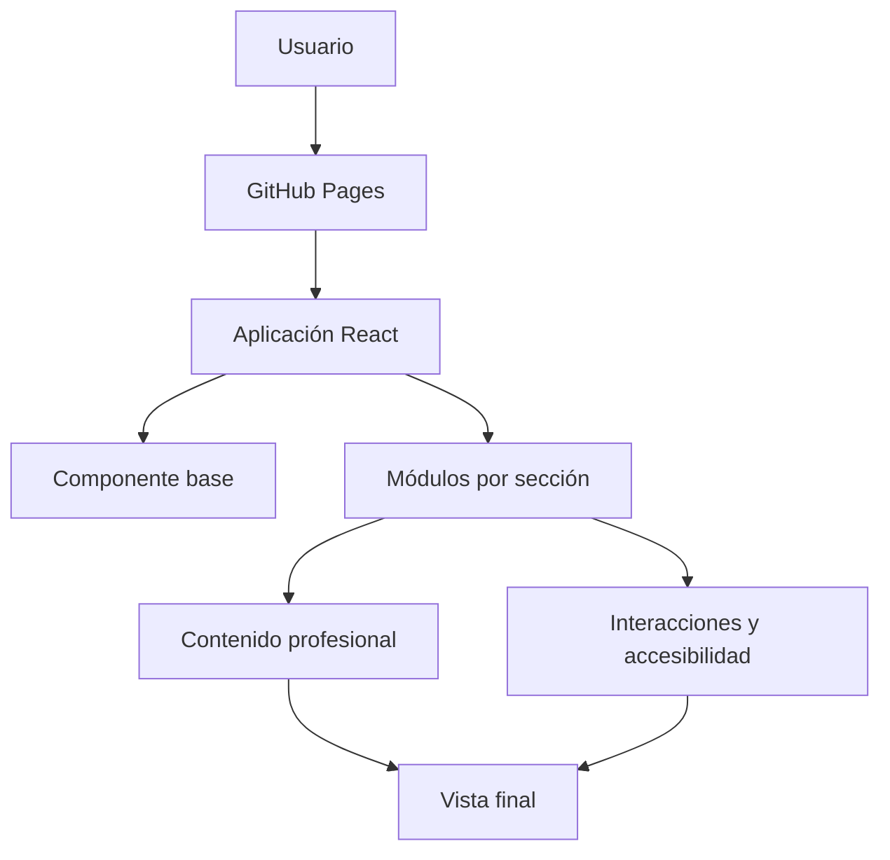

# Portfolio profesional - Dante Gabriel Balbuena Atar

Portfolio web orientado a posiciones junior de **ciberseguridad, SOC, AppSec, DevSecOps y pentesting en entornos autorizados**.

El sitio conecta experiencia operativa en soporte técnico y gestión de incidentes con formación académica y proyectos aplicados de seguridad.

## Enlaces

- **Sitio publicado:** https://dante2617012022.github.io/portfolio-web/
- **Índice de evidencias:** [docs/PORTFOLIO_EVIDENCE_INDEX.md](docs/PORTFOLIO_EVIDENCE_INDEX.md)
- **GitHub:** https://github.com/Dante2617012022
- **LinkedIn:** https://www.linkedin.com/in/dante-gabriel-balbuena-179963235/

## Posicionamiento profesional

**Técnico en Ciberseguridad | Seguridad ofensiva y defensiva junior | AppSec y DevSecOps**

El portfolio diferencia claramente:

- experiencia profesional en soporte, telecomunicaciones, SLA y gestión de incidentes;
- proyectos aplicados de desarrollo y seguridad;
- pentesting y hacking ético realizados en laboratorios académicos autorizados;
- conocimientos en evolución que todavía no constituyen experiencia profesional especializada.

## Proyectos principales

### Camdis Commerce Platform

Plataforma privada de pedidos y operación gastronómica con seguridad integrada:

- Keycloak, OIDC y PKCE;
- clientes y sesiones separados para público y personal;
- Google limitado a clientes;
- contraseña y TOTP para personal;
- RBAC y autorización en la API;
- sesiones BFF con cookies `HttpOnly`;
- CSRF, idempotencia y reglas de negocio en backend;
- PostgreSQL, Docker y Caddy;
- CI con pruebas, secret scanning, Trivy, auditoría y SBOM;
- backups, restauración y rollback.

El código permanece privado por confidencialidad. Se publica un [caso de estudio sanitizado](docs/case-studies/camdis-commerce-security.md).

### Chatbot de pedidos con IA y controles de seguridad

Repositorio público que demuestra:

- arquitectura modular en Node.js;
- parser determinístico y fallback de IA controlado;
- JSON Schema, umbral de confianza y validación contra catálogo;
- bloqueo de acciones sensibles delegadas a IA;
- sanitización, rate limiting y gestión de secretos;
- HMAC para webhooks;
- pruebas automatizadas, CI y CodeQL.

[Ver repositorio](https://github.com/Dante2617012022/chatbot-hamburgueseria-v3)

### Hacking Ético y Tratamiento de Vulnerabilidades

Prácticas académicas sobre CTF, aplicaciones vulnerables y sistemas Linux:

- reconocimiento y enumeración;
- OWASP Top 10;
- SQLi, XSS, CSRF, IDOR, LFI y command injection;
- carga insegura y encadenamiento de hallazgos;
- escalada de privilegios;
- post-explotación, movimiento lateral y pivoting;
- reportes técnicos, impacto y remediación.

[Ver resumen profesional](docs/case-studies/offensive-security-labs.md)

## Objetivos laborales compatibles

- Analista SOC Nivel 1.
- Analista de ciberseguridad junior.
- Pentester o analista de vulnerabilidades junior.
- AppSec junior.
- DevSecOps junior.
- IAM junior.
- Soporte e infraestructura con enfoque en seguridad.

No se afirma experiencia profesional como Red Team Operator. Las técnicas asociadas a red teaming fueron practicadas en laboratorios controlados.

## Competencias transferibles desde experiencia profesional

- Registro, clasificación y seguimiento de incidentes.
- Priorización por impacto y criticidad.
- Trabajo bajo SLA y métricas operativas.
- Diagnóstico, documentación y escalamiento técnico.
- Redes, telecomunicaciones y Linux Debian.
- Comunicación con usuarios y equipos técnicos.

## Tecnologías del portfolio web

- React 19.
- Vite 7.
- JavaScript.
- Framer Motion.
- Tailwind CSS.
- ESLint.
- GitHub Actions.
- GitHub Pages.

## Ejecución local

```bash

git clone git@github.com:Dante2617012022/portfolio-web.git
cd portfolio-web
npm ci
npm run dev
```

Validación:

```bash
npm run lint
npm run build
npm audit --audit-level=high
```

## Seguridad y privacidad

El portfolio es un sitio estático:

- no implementa autenticación;
- no almacena información de visitantes;
- no incorpora base de datos ni backend propio;
- no solicita credenciales;
- utiliza enlaces directos de contacto;
- abre enlaces externos con aislamiento de contexto.

Los casos de estudio sanitizados no publican tokens, cookies, secretos, datos personales, información operativa de Camdis ni payloads ofensivos reutilizables.

## Accesibilidad

- diseño responsive;
- foco visible para teclado;
- compatibilidad con `prefers-reduced-motion`;
- contenido legible sin depender de animaciones;
- enlaces descriptivos y navegación directa.

## Arquitectura actual



## Deuda técnica declarada

- consolidar mejoras progresivas del DOM en componentes React declarativos;
- centralizar el contenido en una fuente de datos única;
- incorporar pruebas de componentes y E2E;
- automatizar accesibilidad y rendimiento;
- reducir módulos correctivos heredados;
- establecer releases y changelog estables.

El detalle se mantiene en [`docs/TECHNICAL_ROADMAP.md`](docs/TECHNICAL_ROADMAP.md).

## Alcance ético

Todas las actividades ofensivas mencionadas fueron realizadas en laboratorios propios o autorizados. No se realizaron pruebas sobre sistemas de terceros fuera del alcance académico.

## Autor

**Dante Gabriel Balbuena Atar**  
Técnico en formación avanzada en Ciberseguridad, con experiencia en soporte técnico, telecomunicaciones, gestión de incidentes y documentación operativa.
