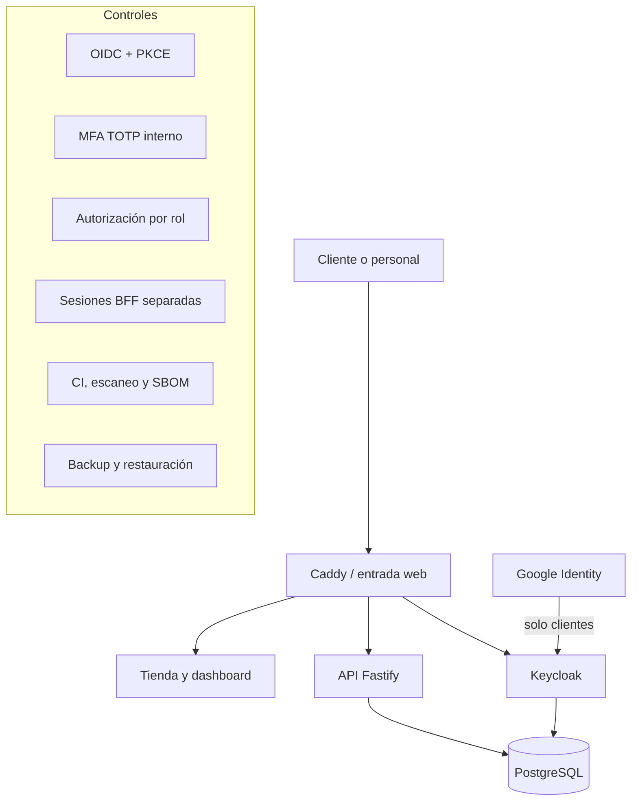

# Caso de estudio - Camdis Commerce Platform

## Resumen

Camdis Commerce Platform es una plataforma de pedidos y operación gastronómica desarrollada como proyecto aplicado para una PyME. El caso combina comercio electrónico, gestión de identidad, autorización por roles, seguridad de APIs, contenedores, continuidad y prácticas DevSecOps.

El repositorio principal permanece privado para proteger información operativa, marca, configuración e implementación específica. Este documento presenta únicamente arquitectura y evidencia sanitizada.

> Estado documentado: piloto técnico en entorno controlado. No procesa pagos reales y no debe interpretarse como una plataforma productiva final.

## Problema

La solución debía atender dos contextos con riesgos diferentes:

- clientes que consultan el catálogo, crean pedidos y revisan únicamente su actividad;
- personal interno de recepción, cocina, gestión y administración con acceso a funciones operativas sensibles.

Compartir autenticación, sesiones y permisos entre ambos contextos habría aumentado el riesgo de confusión de identidad, escalamiento indebido y exposición del panel interno.

## Arquitectura de alto nivel

## Controles implementados

### Identidad y acceso

- Keycloak como proveedor central de identidad.
- Clientes OIDC distintos para clientes y personal interno.
- Authorization Code con PKCE.
- Login local o Google para clientes.
- Contraseña y TOTP para personal.
- Google deshabilitado para el contexto administrativo.
- Validación backend que rechaza sesiones administrativas originadas en un proveedor federado.
- Callbacks, audiencias, cookies y sesiones diferentes por contexto.
- Roles internos para recepción, cocina, gestión y administración.

### Sesiones y frontend

- Cookies `HttpOnly` para evitar la lectura directa desde JavaScript.
- `SameSite` y CSRF para operaciones mutables.
- Sesiones almacenadas del lado servidor.
- Tokens y estado sensible cifrados en el backend.
- Sin persistencia de tokens OIDC en `localStorage`.
- Cookies `Secure` obligatorias en producción con HTTPS.

### API y reglas de negocio

- Validación de esquemas y rechazo de propiedades inesperadas.
- CORS restringido, encabezados de seguridad y limitación de solicitudes.
- Autorización aplicada en la API, no solamente en la interfaz.
- Precios calculados desde datos del servidor.
- Idempotencia para reducir pedidos duplicados.
- Transacciones y trazabilidad de cambios.
- Restricciones de estados para impedir que cocina avance pedidos sin condiciones previas.
- Redacción de cookies, tokens y credenciales en logs.

### Pagos

La plataforma conserva pagos simulados como modo seguro de desarrollo. El piloto de Mercado Pago se mantiene separado hasta completar pruebas en sandbox y staging HTTPS.

Controles diseñados:

- preferencia creada desde el backend;
- importe y moneda validados contra el pedido;
- webhook firmado mediante HMAC;
- consulta posterior al proveedor antes de acreditar;
- validación de referencia externa y metadatos;
- procesamiento idempotente;
- separación estricta de sandbox y producción;
- compuerta independiente para impedir pagos reales accidentales.

### DevSecOps y cadena de suministro

- instalación reproducible mediante `npm ci` y lockfile;
- pruebas automatizadas;
- auditoría de dependencias;
- Gitleaks sobre el historial;
- Trivy para configuración, secretos e imágenes;
- acciones de GitHub fijadas por commit;
- generación de SBOM CycloneDX;
- checksums de artefactos;
- construcción y escaneo de imágenes;
- validaciones de scripts, configuración y redacción de diagnósticos.

### Continuidad

- backup de PostgreSQL y configuración de identidad;
- checksums SHA-256;
- restauración en entorno aislado;
- empaquetado de release;
- procedimientos de actualización y rollback en evolución.

## Separación de identidad

| Contexto | Inicio de sesión | MFA | Google | Sesión |
|---|---|---:|---:|---|
| Cliente | Contraseña o Google | No obligatorio | Permitido | Cookie `HttpOnly` de cliente |
| Personal | Contraseña local | TOTP obligatorio | Rechazado | Cookie `HttpOnly` administrativa |

La ausencia visual del botón Google en el acceso interno no se considera un control suficiente. La API valida el origen de identidad y rechaza el contexto federado para la sesión administrativa.

## Modelo de amenazas resumido

| Riesgo | Control aplicado | Riesgo residual |
|---|---|---|
| Cliente accede a funciones internas | Clientes OIDC, cookies, audiencias y RBAC separados | Requiere pruebas negativas continuas |
| Robo de token desde JavaScript | BFF y cookies `HttpOnly` | Un XSS aún podría operar con la sesión activa |
| Manipulación de precios | Cálculo servidor y validación del catálogo | Requiere pruebas sobre cambios concurrentes |
| Pedido duplicado | Idempotencia y transacciones | Debe probarse bajo concurrencia real |
| Webhook falso | HMAC y verificación posterior | Falta validación dinámica completa en staging |
| Secreto versionado | Variables de entorno, Gitleaks y revisión | Requiere rotación y gestor de secretos productivo |
| Pérdida de datos | Backups, checksums y restauración aislada | Falta copia externa cifrada y política definitiva |
| Dependencia vulnerable | Audit, Trivy y SBOM | Requiere proceso de actualización y aceptación de riesgo |

## Evidencia disponible

- 25 pruebas automatizadas aprobadas para el bloque de identidad y autorización.
- Pruebas de separación entre clientes OIDC.
- Rechazo de identidad federada en administración.
- Login de clientes mediante contraseña y Google.
- Login interno mediante contraseña y TOTP.
- Servicios API, Keycloak y PostgreSQL con health checks.
- Cookies de sesión verificadas como `HttpOnly` en laboratorio.
- CI con auditoría, secret scanning, escaneo de imágenes y SBOM.
- Documentación de arquitectura, amenazas, rollback y evidencias.

Las capturas públicas deben ocultar valores de cookies, tokens, correos, usuarios, Client IDs, rutas privadas y datos operativos.

## Decisiones de diseño

### Seguridad en backend

Los controles de acceso no dependen de esconder botones o rutas. La API valida sesión, contexto, audiencia y rol.

### Redirección OIDC estándar

Se utiliza redirección completa en lugar de ventanas emergentes para reducir JavaScript especial, mantener el intercambio fuera del frontend y simplificar soporte.

### Pagos bloqueados por defecto

El modo real requiere una combinación explícita de entorno productivo y habilitación independiente. El retorno del navegador no acredita por sí solo un pedido.

### Cambios reversibles

Las funcionalidades sensibles se desarrollan en ramas, con pull requests, CI y respaldo previo a integraciones grandes.

## Limitaciones actuales

- El entorno validado utiliza laboratorio local; producción requiere dominio, HTTPS, Cloudflare y firewall.
- Mercado Pago todavía necesita pruebas dinámicas completas en sandbox.
- Faltan monitoreo, alertas y centralización de logs.
- Los backups requieren copia externa cifrada y política de retención.
- Falta prueba de carga, concurrencia y DAST sobre staging.
- La administración de catálogo, delivery y otras funciones comerciales continúa en desarrollo.
- No se realizó todavía un pentest independiente previo a producción.

## Competencias demostradas

- AppSec y diseño seguro.
- IAM, OIDC, PKCE, MFA y RBAC.
- Seguridad de sesiones y APIs.
- Threat modeling y defensa en profundidad.
- Docker, Caddy, PostgreSQL y Keycloak.
- DevSecOps, secret scanning, SBOM y seguridad de supply chain.
- Backups, restauración y rollback.
- Documentación técnica y comunicación de riesgo residual.

## Resultado

El proyecto demuestra cómo integrar controles de seguridad desde la arquitectura y el ciclo de desarrollo, en lugar de agregarlos solamente al final. Su valor para el portfolio reside en poder explicar qué riesgo se identificó, qué control se implementó, dónde se aplica, cómo se verificó y qué limitación permanece.
