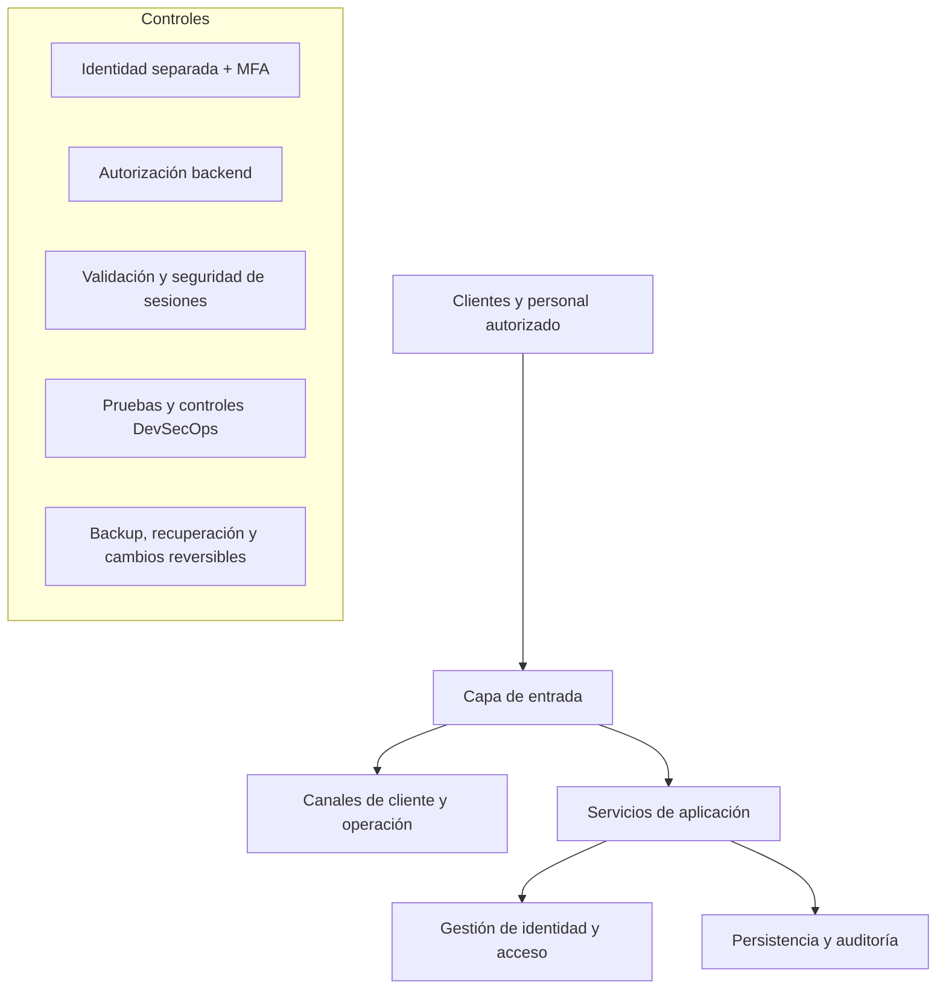

# Caso de estudio - Camdis Commerce Platform

## Resumen

Camdis Commerce Platform es una plataforma privada de pedidos y operación gastronómica desarrollada como proyecto aplicado para una PyME. El caso combina comercio electrónico, gestión de identidad, autorización, seguridad de APIs, continuidad y prácticas DevSecOps.

El repositorio principal, la configuración y la arquitectura operativa permanecen privados. Este documento presenta decisiones, controles y evidencia sanitizada para demostrar competencias sin publicar un inventario utilizable contra el sistema.

> Estado documentado: piloto técnico en entorno controlado. No procesa pagos reales y no debe interpretarse como una plataforma productiva final.

## Problema

La solución debía atender dos contextos con riesgos diferentes:

- clientes que consultan el catálogo, crean pedidos y revisan únicamente su actividad;
- personal interno con acceso a funciones operativas sensibles.

Compartir identidad, sesiones y permisos entre ambos contextos habría aumentado el riesgo de confusión de identidad, escalamiento indebido y exposición de funciones internas.

## Arquitectura conceptual sanitizada

El diagrama es deliberadamente conceptual. No representa dominios, IP, redes, puertos, proveedores, rutas, nombres internos, versiones ni la topología del entorno productivo.

## Controles implementados

### Identidad y acceso

- Contextos de autenticación separados para clientes y personal.
- Authorization Code con PKCE.
- MFA obligatorio para funciones internas sensibles.
- Inicio de sesión federado limitado al contexto permitido.
- Validación backend del contexto de identidad antes de crear una sesión interna.
- Autorización por roles aplicada en la API.

### Sesiones y frontend

- Cookies `HttpOnly` para evitar lectura directa desde JavaScript.
- `SameSite`, protección CSRF y cookies `Secure` en entornos HTTPS.
- Sesiones y estado sensible almacenados del lado servidor.
- Sin persistencia de tokens de identidad en `localStorage`.
- Separación entre sesión pública y sesión administrativa.

### API y reglas de negocio

- Validación de esquemas y rechazo de propiedades inesperadas.
- Autorización aplicada en backend, no solamente mediante controles visuales.
- Precios y estados calculados o validados desde datos confiables del servidor.
- Idempotencia y transacciones para reducir operaciones duplicadas o inconsistentes.
- Trazabilidad de cambios y redacción de información sensible en logs.
- Encabezados de seguridad, CORS restringido y limitación de solicitudes.

### Pagos

El proyecto conserva un modo simulado como opción segura de desarrollo. La integración con el proveedor de pagos permanece separada hasta completar pruebas dinámicas en un entorno autorizado.

Controles diseñados:

- creación de operaciones desde backend;
- validación de importe, moneda y referencias contra el pedido;
- autenticación de notificaciones y confirmación posterior con el proveedor;
- procesamiento idempotente;
- separación estricta entre prueba y operación real;
- habilitación productiva bloqueada por defecto.

### DevSecOps y cadena de suministro

- instalación reproducible mediante lockfile;
- pruebas automatizadas;
- análisis estático de código;
- detección de secretos;
- auditoría y escaneo de dependencias, configuración e imágenes;
- acciones de CI fijadas por commit;
- generación de SBOM CycloneDX;
- checksums de artefactos;
- validaciones sobre scripts, paquetes y diagnósticos.

### Continuidad

- backups de datos y configuración crítica;
- checksums para verificar integridad;
- restauración en entorno aislado;
- empaquetado de releases;
- procedimientos de actualización y rollback en evolución.

## Modelo de amenazas resumido

| Riesgo | Control aplicado | Tratamiento residual |
|---|---|---|
| Un cliente intenta acceder a funciones internas | Separación de contexto, sesión y autorización backend | Pruebas negativas continuas |
| Robo o abuso de sesión | Cookies protegidas, CSRF y estado del lado servidor | Defensa en profundidad y monitoreo |
| Manipulación de precios o estados | Validación y reglas de negocio en backend | Pruebas de concurrencia y regresión |
| Operaciones duplicadas | Idempotencia y transacciones | Validación bajo carga controlada |
| Notificación de pago falsa | Autenticación y verificación posterior | Pruebas dinámicas autorizadas |
| Secreto incorporado al código | Variables externas, detección automática y revisión | Rotación y gobierno continuo |
| Pérdida o corrupción de datos | Backup, integridad y restauración aislada | Pruebas periódicas de recuperación |
| Dependencia vulnerable | Auditoría, escaneo y SBOM | Actualización y aceptación formal de riesgo |

## Evidencia disponible

- Pruebas automatizadas de identidad, sesiones y autorización.
- Pruebas negativas de separación entre clientes y personal.
- Validación de MFA en el contexto interno.
- Servicios con health checks en laboratorio.
- Cookies de sesión verificadas como `HttpOnly` en entorno controlado.
- CI con pruebas, análisis estático, detección de secretos, escaneo y SBOM.
- Documentación privada de arquitectura, amenazas, recuperación y cambios reversibles.

Las capturas y documentos públicos deben ocultar valores de cookies, tokens, correos, usuarios, identificadores, URLs, rutas privadas y datos operativos.

## Decisiones de diseño

### Seguridad en backend

Los controles de acceso no dependen de esconder botones o rutas. El backend valida sesión, contexto y permisos antes de ejecutar acciones.

### Identidad basada en estándares

Se utilizan flujos estándar de identidad y redirección para mantener el intercambio sensible fuera del frontend y reducir lógica especial en el navegador.

### Pagos bloqueados por defecto

El retorno del navegador no acredita por sí solo un pedido. La habilitación real requiere condiciones explícitas y validaciones independientes.

### Cambios reversibles

Las funcionalidades sensibles se desarrollan en ramas, con pull requests, CI y respaldo previo a integraciones grandes.

## Estado y limitaciones

La plataforma continúa en piloto técnico. La preparación productiva se mantiene en evaluación en cuatro áreas generales: validación dinámica, observabilidad, continuidad externa y revisión independiente. El detalle operativo y los controles pendientes permanecen en documentación privada para evitar publicar una lista accionable de defensas ausentes.

## Límite de divulgación pública

Este caso no publica:

- topología productiva, redes, IP, puertos o proveedor de hosting;
- dominios internos, rutas administrativas o endpoints completos;
- versiones operativas ni asociaciones exactas entre herramientas y servicios;
- nombres de clientes IAM, cookies, audiencias, roles o cuentas;
- configuración, secretos, certificados, logs o datos comerciales;
- hallazgos abiertos o controles pendientes con detalle explotable.

Las tecnologías concretas pueden aparecer en el perfil como competencias generales, pero no se presentan aquí como un mapa del sistema real.

## Competencias demostradas

- AppSec y diseño seguro.
- IAM, OIDC, PKCE, MFA y RBAC.
- Seguridad de sesiones y APIs.
- Threat modeling y defensa en profundidad.
- Contenedores, backend web, persistencia relacional y reverse proxy.
- DevSecOps, análisis estático, detección de secretos, SBOM y seguridad de supply chain.
- Backups, restauración y rollback.
- Documentación técnica y comunicación de riesgo residual.

## Resultado

El proyecto demuestra cómo integrar controles de seguridad desde la arquitectura y el ciclo de desarrollo. Su valor para el portfolio reside en poder explicar qué riesgo se identificó, qué control se implementó, cómo se verificó y qué evidencia puede compartirse sin comprometer la confidencialidad del sistema.
