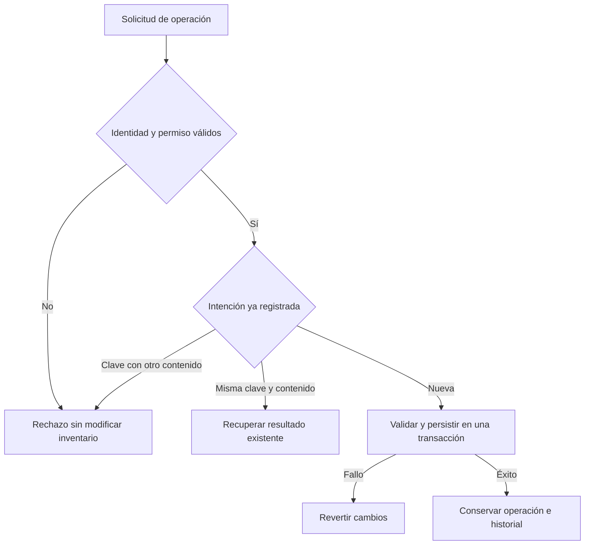

# Camdis Operations Platform: seguridad aplicada a producción e inventario

**Proyecto principal de Dante Gabriel Balbuena Atar · Técnico Universitario en Ciberseguridad**

## El proyecto en dos minutos

Camdis Operations es el componente de producción e inventario de mi proyecto ERP para una PyME gastronómica. Organiza movimientos de materiales, producción y correcciones para poder responder **quién actuó, qué cambió y cómo se conserva la consistencia si una operación falla o se repite**.

| Pregunta | Respuesta |
|---|---|
| ¿Qué problema aborda? | Registros informales, errores por reintentos y dificultad para reconstruir cambios de inventario. |
| ¿Cuál es mi aporte? | Diseño y desarrollo de flujos, controles de acceso, integridad, pruebas y documentación del proyecto propio. |
| ¿Qué lo hace relevante para seguridad? | Los permisos, la consistencia y la trazabilidad se verifican en el servidor y la persistencia. |
| ¿En qué estado está? | Beta interna controlada; integración de código y despliegue operativo son etapas diferentes. |
| ¿Qué puede revisar un evaluador? | Tres controles detallados debajo, resultados acotados y un recorrido de demostración con datos ficticios. |

El alcance es producción, depósito e inventario. No se presenta como un ERP integral de contabilidad, ventas y recursos humanos. El comercio electrónico es un proyecto separado: [Camdis Commerce](camdis-commerce-security.md).

## Tres controles para una revisión técnica

### 1. Autorizar antes de modificar

**Riesgo:** que una identidad sin permisos pueda registrar o corregir operaciones, aunque la interfaz le oculte el botón.

**Decisión:** comprobar identidad y permisos en el servidor antes de acceder a la operación protegida. La identidad del actor proviene de la autenticación; no se acepta que el cliente la elija como parte del registro.

**Evidencia:** pruebas automatizadas de autenticación y autorización comprueban rechazos y casos permitidos. Algunos casos verifican expresamente que una solicitud no autorizada no acceda a la base de datos. Estas pruebas forman parte de la suite API revisada.

**Límite:** verificar un caso de autorización no prueba que todo el sistema esté libre de fallos de acceso. La revisión debe considerar cada operación y sus reglas.

### 2. Evitar que un reintento duplique inventario

**Riesgo:** una respuesta tarda, el usuario reintenta y se registra dos veces la misma recepción.

**Decisión:** combinar clave de idempotencia, huella del contenido, unicidad en persistencia y una transacción. La misma intención recupera el resultado existente; reutilizar una clave con otro contenido se rechaza.

**Evidencia histórica:** un ensayo documentado con ocho solicitudes concurrentes equivalentes produjo una recepción nueva y siete respuestas de reutilización, vinculadas al mismo registro. La suite API también prueba reutilización, conflicto de contenido y rollback ante fallos.

**Por qué esta decisión:** deshabilitar un botón o consultar si el registro existe antes de insertar no resuelve por sí solo dos solicitudes simultáneas.

**Límite:** el ensayo utiliza datos artificiales y un escenario concreto. No equivale a una prueba de carga de producción ni demuestra entrega exactamente una vez en cualquier sistema distribuido.

### 3. Corregir conservando el historial

**Riesgo:** que corregir una cantidad elimine la evidencia original e impida reconstruir lo ocurrido.

**Decisión:** conservar el registro original y añadir correcciones o movimientos compensatorios autorizados. La operación debe preservar las reglas de stock y su consistencia transaccional.

**Evidencia:** pruebas automatizadas sobre correcciones, permisos y restricciones de stock; además, existe validación operativa histórica documentada de corrección y anulación de conteos.

**Límite:** se demuestra trazabilidad protegida por controles de acceso. No se afirma no repudio criptográfico ni inmutabilidad frente a cualquier administrador.

## Flujo conceptual de una operación

Este esquema explica responsabilidades de seguridad; **no representa la topología operativa**.

## Evidencia y su alcance

| Evidencia | Resultado observado | Qué permite concluir |
|---|---|---|
| Suite API de la revisión de mantenimiento del 21/09/2026 | 393 pruebas aprobadas | Los casos automatizados de esa revisión pasaron; no es una medida de cobertura total. |
| Extracción de utilidades compartidas | 37 definiciones locales sustituidas por tres implementaciones; 213 líneas netas de fuentes retiradas | Se redujo duplicación en un alcance definido. |
| Comparación antes/después de esa extracción | 1.332 comparaciones de resultados y errores sin diferencias | Equivalencia para las entradas comparadas, no una prueba formal de todo comportamiento posible. |
| Controles de integración de esa revisión | API y estructura aprobados antes de integrar | La revisión pasó los controles aplicables; no demuestra despliegue ni nueva UAT. |
| Ensayos operativos anteriores | Concurrencia, correcciones y recuperación documentadas | Evidencia histórica con su alcance original; no se volvió a ejecutar durante la edición de este caso público. |

Las pruebas API incluyen dependencias simuladas. Los ensayos de base de datos y las validaciones con operadores tienen alcances propios y no se suman como si fueran la misma clase de evidencia.

Los resultados completos y el código operativo permanecen privados. Esta página es un resumen público contrastado con evidencia interna, **no un informe independiente ni una suite reproducible desde este repositorio público**.

## Recorrido para una entrevista

El [guion de demostración](camdis-operations-walkthrough.md) propone tres escenas con datos ficticios y criterios observables. Es una guía para preparar una sesión; no sustituye una grabación ni declara que esa sesión ya se haya ejecutado.

Para profundizar, puedo explicar:

- por qué la autorización pertenece al servidor;
- cómo se combinan idempotencia, unicidad y transacciones;
- qué diferencia hay entre corregir un registro y borrar su historia;
- qué comprueban las pruebas automatizadas y qué requiere validación operativa.

## Estado y límites

La beta, el código integrado y lo instalado no deben confundirse. Los cambios siguen una revisión con pruebas y, cuando corresponde, validación con operadores. La madurez operativa, la cobertura y la evolución funcional se evalúan por alcance; no se afirma que el sistema esté terminado o sea invulnerable.

Las tecnologías y patrones se presentan como competencias. No se publican datos reales, configuraciones, accesos ni detalles del entorno operativo.

**Competencias demostradas:** autorización en servidor, mínimo privilegio, idempotencia, transacciones, concurrencia, trazabilidad, pruebas y mantenimiento seguro.

[Índice de evidencias](../PORTFOLIO_EVIDENCE_INDEX.md) · [Política de divulgación](../PUBLIC_DISCLOSURE_POLICY.md) · [Contacto profesional](https://dante2617012022.github.io/portfolio-web/#cv)
